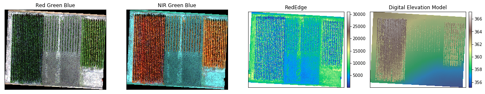
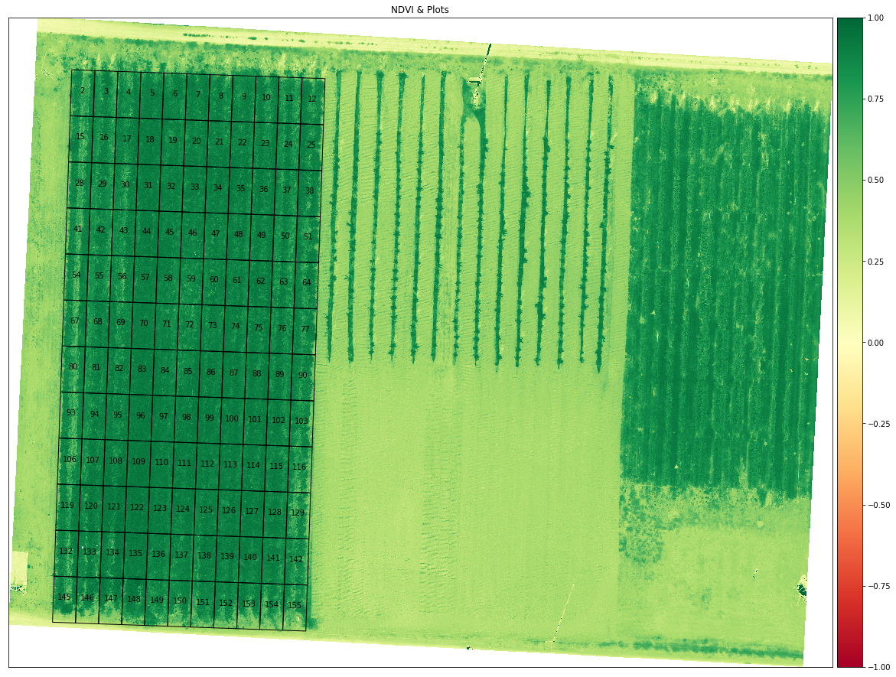
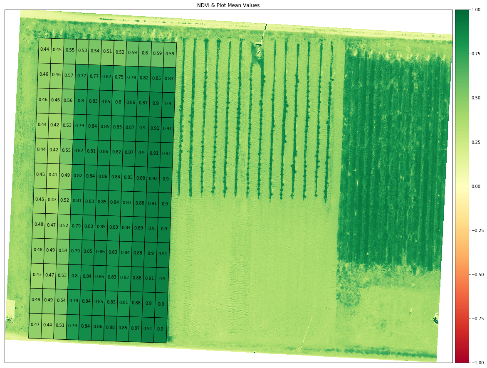
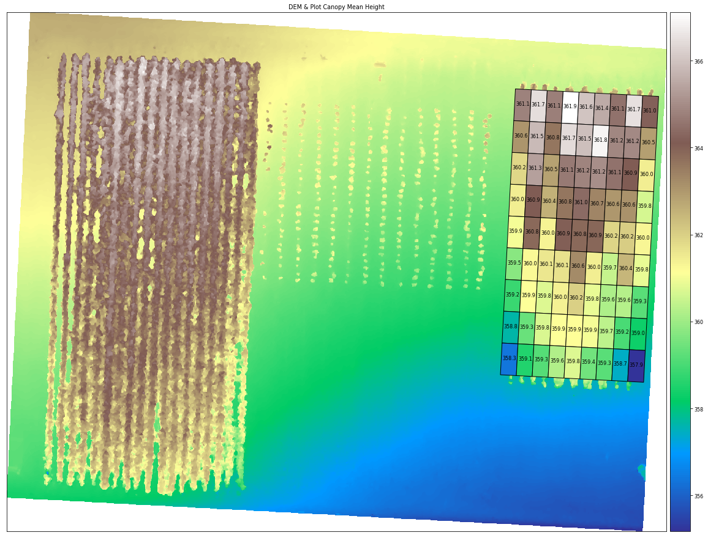
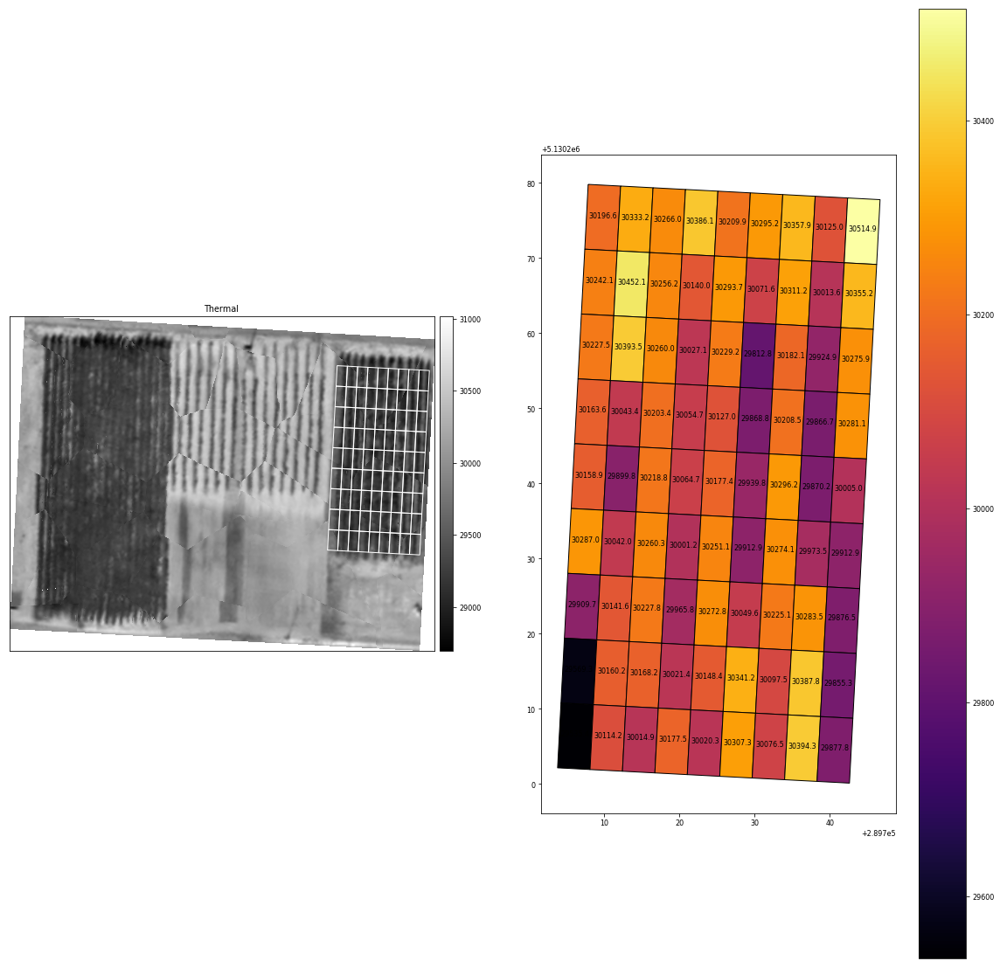
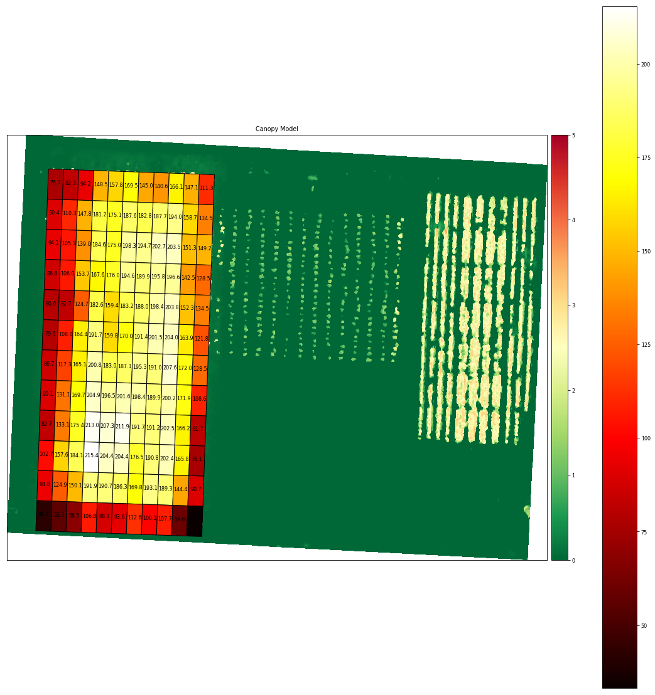
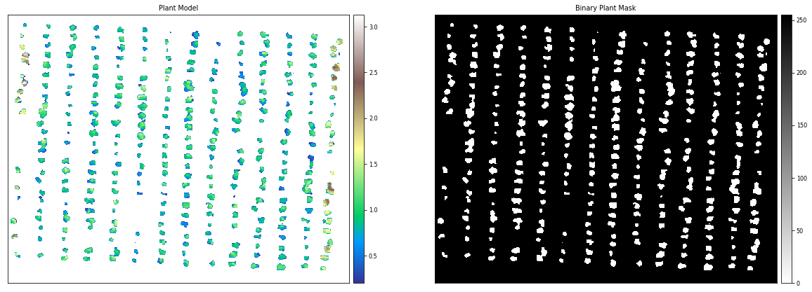
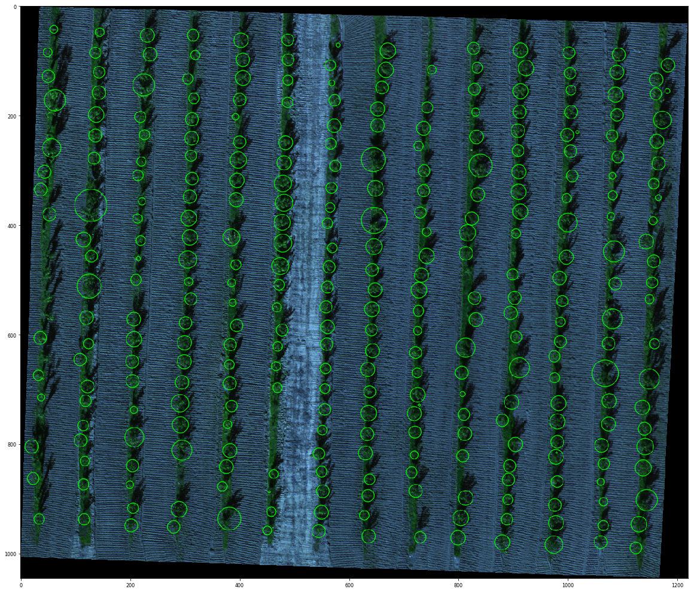

## DroneMapper Crop Analysis
A jupyter notebook with crop analysis algorithms utilizing digital elevation models, dtm and multi-spectral imagery (R-G-B-NIR-Rededge-Thermal) from a [MicaSense Altum](https://micasense.com) sensor processed with [DroneMapper Remote Expert](https://dronemapper.com).

Due to limitations on git file sizes, you will need to download the GeoTIFF data for this project from the following url: [https://dronemapper.com/software/DroneMapper_CropAnalysis_Data.zip](https://dronemapper.com/software/DroneMapper_CropAnalysis_Data.zip). Once that has been completed, extract the TIF files into the notebook data directory matching the structure below.

### Included Data
* data/DrnMppr-DEM-AOI.tif - 32bit georeferenced digital elevation model
* data/DrnMppr-ORT-AOI.tif - 16bit georeferenced orthomosaic (Red-Green-Blue-NIR-Rededge-Thermal)
* data/DrnMppr-DTM-AOI.tif - 32bit georeferenced dtm
* data/plant_count.shp - plant count AOI
* data/plots_1.shp - plot 1 AOI
* data/plots_2.shp - plot 2 AOI

### Algorithms
* plot volume/biomass
* plot canopy height
* plot ndvi zonal statistics
* plot thermals
* plant count

## Notes
These basic algorithms are intended to get you started and interested in multi-spectral processing and analysis.

The orthomosaic, digital elevation model, and dtm were clipped to an AOI using [GlobalMapper](https://bluemarblegeo.com). The shapefile plots were also generated using GlobalMapper grid tool. We highly recommend GlobalMapper for GIS work!

We cloned the MicaSense [imageprocessing](https://github.com/dronemapper-io/imageprocessing) repository and created the `Batch Processing DroneMapper.ipynb` notebook which allows you to quickly align and stack a Altum or RedEdge dataset creating the correct TIF files with EXIF/GPS metadata preserved. These stacked TIF files are then directly loaded into DroneMapper Remote Expert for processing.

This notebook assumes the user has basic knowledge of setting up their python environment, importing libraries and working inside jupyter.

## Do More!
Implement additional algorithms like NDRE or alternative methods for plant counts. Submit a pull request!


```python
%load_ext autoreload
%autoreload 2
```

### Load Digital Elevation Model and Orthomosaic


```python
import numpy as np
import rasterio
from matplotlib import pyplot as plt
import matplotlib as mpl

import earthpy as et
import earthpy.plot as ep
import earthpy.spatial as es

# ensure libspatialindex-dev is installed via apt-get or yum

%matplotlib inline

dem = rasterio.open('data/DrnMppr-DEM-AOI.tif')
ortho = rasterio.open('data/DrnMppr-ORT-AOI.tif')

dem_arr = dem.read()
ortho_arr = ortho.read()

# mask elevation <= 0
elevation = dem_arr[0]
elevation[elevation <= 0] = np.nan

# rededge mask <= 0
masked_re = np.ma.masked_where(ortho_arr[4] <= 0, ortho_arr[4])

# generate hillshade
hillshade = es.hillshade(elevation, altitude=30, azimuth=210)

fig, ax = plt.subplots(1, 4, figsize=(20, 20))

# plot
ep.plot_rgb(ortho_arr, ax=ax[0], rgb=[0, 1, 2], title="Red Green Blue", stretch=True)
ep.plot_rgb(ortho_arr, ax=ax[1], rgb=[3, 1, 2], title="NIR Green Blue", stretch=True)
ep.plot_bands(masked_re, ax=ax[2], scale=False, cmap="terrain", title="RedEdge")
ep.plot_bands(elevation, ax=ax[3], scale=False, cmap="terrain", title="Digital Elevation Model")
ax[3].imshow(hillshade, cmap="Greys", alpha=0.5)
plt.show()

```





### Load Plot 1 AOI and Generate NDVI


```python
import geopandas as gpd
from rasterio.plot import plotting_extent

np.seterr(divide='ignore', invalid='ignore')

fig, ax = plt.subplots(figsize=(20, 20))
plot_extent = plotting_extent(dem_arr[0], dem.transform)

# generate ndvi
ndvi = es.normalized_diff(ortho_arr[3], ortho_arr[0])
ep.plot_bands(ndvi, 
              ax=ax, 
              cmap="RdYlGn",
              title="NDVI & Plots", 
              scale=False, 
              vmin=-1, 
              vmax=1, 
              extent=plot_extent)

plots = gpd.read_file('data/plots_1.shp')
plots.plot(ax=ax,
           color='None', 
           edgecolor='black', 
           linewidth=1)

# show plot names
plots.apply(lambda x: ax.annotate(s=x.NAME, xy=x.geometry.centroid.coords[0], ha='center'), axis=1);
plt.show()
```





### Generate NDVI Zonal Statistics For Each Plot


```python
import rasterstats as rs
from shapely.geometry import Polygon
from IPython.display import display

# compute zonal statistics on each plot
plot_zs = rs.zonal_stats(plots, 
                         ndvi, 
                         nodata=0, 
                         affine=dem.transform, 
                         geojson_out=True, 
                         copy_properties=True, 
                         stats="count min mean max median std")

# build dataframe and display first 5 records
plot_df = gpd.GeoDataFrame.from_features(plot_zs)
display(plot_df.head())
plot_df.to_csv('output/aoi1_plot_mean_ndvi.csv')

fig, ax = plt.subplots(figsize=(20, 20))

# plot ndvi
ep.plot_bands(ndvi, 
              ax=ax, 
              cmap="RdYlGn",
              title="NDVI & Plot Mean Values", 
              scale=False, 
              vmin=-1, 
              vmax=1, 
              extent=plot_extent)

# overlay the mean ndvi value color for each plot and all pixels inside plot
plot_df.plot('mean',
             ax=ax, 
             cmap='RdYlGn', 
             edgecolor='black', 
             linewidth=1,
             vmin=-1,
             vmax=1)

# show plot mean values
plot_df.apply(lambda x: ax.annotate(s='{:.2}'.format(x['mean']), xy=x.geometry.centroid.coords[0], ha='center'), axis=1);
plt.show()
```


<div>
<table border="1" class="dataframe">
  <thead>
    <tr style="text-align: right;">
      <th></th>
      <th>geometry</th>
      <th>LAYER</th>
      <th>MAP_NAME</th>
      <th>NAME</th>
      <th>min</th>
      <th>max</th>
      <th>mean</th>
      <th>count</th>
      <th>std</th>
      <th>median</th>
    </tr>
  </thead>
  <tbody>
    <tr>
      <th>0</th>
      <td>POLYGON Z ((289583.708 5130289.226 0.000, 2895...</td>
      <td>Coverage/Quad</td>
      <td>User Created Features</td>
      <td>2</td>
      <td>0.188461</td>
      <td>0.873092</td>
      <td>0.438559</td>
      <td>4444</td>
      <td>0.078921</td>
      <td>0.436500</td>
    </tr>
    <tr>
      <th>1</th>
      <td>POLYGON Z ((289588.705 5130289.052 0.000, 2895...</td>
      <td>Coverage/Quad</td>
      <td>User Created Features</td>
      <td>3</td>
      <td>0.193214</td>
      <td>0.887971</td>
      <td>0.445282</td>
      <td>4440</td>
      <td>0.091090</td>
      <td>0.425304</td>
    </tr>
    <tr>
      <th>2</th>
      <td>POLYGON Z ((289593.702 5130288.877 0.000, 2895...</td>
      <td>Coverage/Quad</td>
      <td>User Created Features</td>
      <td>4</td>
      <td>0.232222</td>
      <td>0.890147</td>
      <td>0.552864</td>
      <td>4440</td>
      <td>0.112440</td>
      <td>0.519746</td>
    </tr>
    <tr>
      <th>3</th>
      <td>POLYGON Z ((289598.699 5130288.703 0.000, 2896...</td>
      <td>Coverage/Quad</td>
      <td>User Created Features</td>
      <td>5</td>
      <td>0.090825</td>
      <td>0.865083</td>
      <td>0.530295</td>
      <td>4444</td>
      <td>0.110570</td>
      <td>0.515392</td>
    </tr>
    <tr>
      <th>4</th>
      <td>POLYGON Z ((289603.696 5130288.528 0.000, 2896...</td>
      <td>Coverage/Quad</td>
      <td>User Created Features</td>
      <td>6</td>
      <td>0.104697</td>
      <td>0.922450</td>
      <td>0.536660</td>
      <td>4442</td>
      <td>0.132731</td>
      <td>0.495813</td>
    </tr>
  </tbody>
</table>
</div>





You can view the Plot 1 AOI mean plot NDVI values: [aoi1_plot_mean_ndvi.csv](output/aoi1_plot_mean_ndvi.csv)
### Load Plot 2 AOI & Compute DEM Canopy Mean Height For Each Plot


```python
plots = gpd.read_file('data/plots_2.shp')
plt.rcParams.update({'font.size': 8})

# compute zonal statistics on each plot
plot_zs = rs.zonal_stats(plots, 
                         elevation, 
                         nodata=0, 
                         affine=dem.transform, 
                         geojson_out=True, 
                         copy_properties=True, 
                         stats="count min mean max median std")

# build dataframe and display first 5 records
plot_df = gpd.GeoDataFrame.from_features(plot_zs)
display(plot_df.head())
plot_df.to_csv('output/aoi2_plot_mean_height.csv')

fig, ax = plt.subplots(figsize=(20, 20))

# plot dem
ep.plot_bands(elevation, 
              ax=ax, 
              cmap="terrain",
              title="DEM & Plot Canopy Mean Height", 
              scale=False, 
              extent=plot_extent)

# overlay the mean dem value color for each plot and all pixels inside plot
plot_df.plot('mean',
             ax=ax, 
             cmap='terrain', 
             edgecolor='black', 
             linewidth=1)

# show plot mean values
plot_df.apply(lambda x: ax.annotate(s='{0:0.1f}'.format(x['mean']), xy=x.geometry.centroid.coords[0], ha='center'), axis=1);
plt.show()
```


<div>
<table border="1" class="dataframe">
  <thead>
    <tr style="text-align: right;">
      <th></th>
      <th>geometry</th>
      <th>LAYER</th>
      <th>MAP_NAME</th>
      <th>NAME</th>
      <th>min</th>
      <th>max</th>
      <th>mean</th>
      <th>count</th>
      <th>std</th>
      <th>median</th>
    </tr>
  </thead>
  <tbody>
    <tr>
      <th>0</th>
      <td>POLYGON Z ((289707.875 5130279.812 1182.502, 2...</td>
      <td>Coverage/Quad</td>
      <td>User Created Features - Coverage/Quad</td>
      <td>1</td>
      <td>360.129120</td>
      <td>363.381683</td>
      <td>361.141294</td>
      <td>3318</td>
      <td>1.091593</td>
      <td>360.441467</td>
    </tr>
    <tr>
      <th>1</th>
      <td>POLYGON Z ((289712.189 5130279.586 1190.569, 2...</td>
      <td>Coverage/Quad</td>
      <td>User Created Features - Coverage/Quad</td>
      <td>2</td>
      <td>360.131866</td>
      <td>363.382446</td>
      <td>361.710297</td>
      <td>3316</td>
      <td>1.215926</td>
      <td>361.927017</td>
    </tr>
    <tr>
      <th>2</th>
      <td>POLYGON Z ((289716.503 5130279.360 1183.212, 2...</td>
      <td>Coverage/Quad</td>
      <td>User Created Features - Coverage/Quad</td>
      <td>3</td>
      <td>360.117279</td>
      <td>363.384766</td>
      <td>361.138592</td>
      <td>3310</td>
      <td>1.122890</td>
      <td>360.425781</td>
    </tr>
    <tr>
      <th>3</th>
      <td>POLYGON Z ((289720.817 5130279.134 1182.668, 2...</td>
      <td>Coverage/Quad</td>
      <td>User Created Features - Coverage/Quad</td>
      <td>4</td>
      <td>360.110443</td>
      <td>363.387207</td>
      <td>361.915436</td>
      <td>3322</td>
      <td>1.258644</td>
      <td>362.585251</td>
    </tr>
    <tr>
      <th>4</th>
      <td>POLYGON Z ((289725.131 5130278.908 1182.782, 2...</td>
      <td>Coverage/Quad</td>
      <td>User Created Features - Coverage/Quad</td>
      <td>5</td>
      <td>360.006683</td>
      <td>363.377991</td>
      <td>361.558501</td>
      <td>3320</td>
      <td>1.305164</td>
      <td>360.546524</td>
    </tr>
  </tbody>
</table>
</div>





You can view the Plot 2 AOI mean plot height values: [aoi2_plot_mean_height.csv](output/aoi2_plot_mean_height.csv)
### Compute Thermal Mean For Each Plot
The thermal band (6) in the processed orthomosaic shows stitching artifacts which could likely be improved using more accurate pre-processing alignment and de-distortion algorithms. You can find more information about these functions in the MicaSense imageprocessing github repository. See notes at the top of this notebook.


```python
# thermal mask <= 0
masked_thermal = np.ma.masked_where(ortho_arr[5] <= 0, ortho_arr[5])

# compute zonal statistics on each plot
plot_zs = rs.zonal_stats(plots, 
                         masked_thermal, 
                         nodata=0, 
                         affine=dem.transform, 
                         geojson_out=True, 
                         copy_properties=True, 
                         stats="count min mean max median std")

# build dataframe and display first 5 records
plot_df = gpd.GeoDataFrame.from_features(plot_zs)
display(plot_df.head())
plot_df.to_csv('output/aoi2_plot_mean_thermal.csv')

fig, ax = plt.subplots(1, 2, figsize=(20, 20))

# plot thermal
ep.plot_bands(masked_thermal,
              ax=ax[0], 
              scale=False, 
              cmap="gist_gray", 
              title="Thermal",
              extent=plot_extent)

plots.plot(ax=ax[0], color='None', edgecolor='white', linewidth=1)

# display thermal plot
plot_df.plot('mean',
             ax=ax[1], 
             cmap='inferno', 
             edgecolor='black',
             linewidth=1,
             legend=True)


# show plot mean values
plot_df.apply(lambda x: ax[1].annotate(s='{0:0.1f}'.format(x['mean']), xy=x.geometry.centroid.coords[0], ha='center'), axis=1);
plt.show()
```


<div>
<table border="1" class="dataframe">
  <thead>
    <tr style="text-align: right;">
      <th></th>
      <th>geometry</th>
      <th>LAYER</th>
      <th>MAP_NAME</th>
      <th>NAME</th>
      <th>min</th>
      <th>max</th>
      <th>mean</th>
      <th>count</th>
      <th>std</th>
      <th>median</th>
    </tr>
  </thead>
  <tbody>
    <tr>
      <th>0</th>
      <td>POLYGON Z ((289707.875 5130279.812 1182.502, 2...</td>
      <td>Coverage/Quad</td>
      <td>User Created Features - Coverage/Quad</td>
      <td>1</td>
      <td>30008.0</td>
      <td>30431.0</td>
      <td>30196.628692</td>
      <td>3318</td>
      <td>120.982058</td>
      <td>30193.0</td>
    </tr>
    <tr>
      <th>1</th>
      <td>POLYGON Z ((289712.189 5130279.586 1190.569, 2...</td>
      <td>Coverage/Quad</td>
      <td>User Created Features - Coverage/Quad</td>
      <td>2</td>
      <td>30068.0</td>
      <td>30560.0</td>
      <td>30333.192702</td>
      <td>3316</td>
      <td>123.856093</td>
      <td>30332.0</td>
    </tr>
    <tr>
      <th>2</th>
      <td>POLYGON Z ((289716.503 5130279.360 1183.212, 2...</td>
      <td>Coverage/Quad</td>
      <td>User Created Features - Coverage/Quad</td>
      <td>3</td>
      <td>29792.0</td>
      <td>30645.0</td>
      <td>30266.030211</td>
      <td>3310</td>
      <td>170.831207</td>
      <td>30275.5</td>
    </tr>
    <tr>
      <th>3</th>
      <td>POLYGON Z ((289720.817 5130279.134 1182.668, 2...</td>
      <td>Coverage/Quad</td>
      <td>User Created Features - Coverage/Quad</td>
      <td>4</td>
      <td>29790.0</td>
      <td>30700.0</td>
      <td>30386.137267</td>
      <td>3322</td>
      <td>201.266919</td>
      <td>30391.0</td>
    </tr>
    <tr>
      <th>4</th>
      <td>POLYGON Z ((289725.131 5130278.908 1182.782, 2...</td>
      <td>Coverage/Quad</td>
      <td>User Created Features - Coverage/Quad</td>
      <td>5</td>
      <td>29618.0</td>
      <td>30691.0</td>
      <td>30209.904518</td>
      <td>3320</td>
      <td>292.299392</td>
      <td>30262.0</td>
    </tr>
  </tbody>
</table>
</div>





You can view the Plot 2 AOI mean plot thermal values: [aoi2_plot_mean_thermal.csv](output/aoi2_plot_mean_thermal.csv)
### Load Plot 1 AOI & Compute Volume/Biomass For Each Plot


```python
# we will use the masked dtm and masked elevation data
plots = gpd.read_file('data/plots_1.shp')

dtm = rasterio.open('data/DrnMppr-DTM-AOI.tif')
dtm_arr = dtm.read()

# mask dtm <= 0
elevation_dtm = dtm_arr[0]
elevation_dtm[elevation_dtm <= 0] = np.nan

# create canopy model
canopy_model = (elevation - elevation_dtm)

# compute zonal statistics on each plot
plot_zs = rs.zonal_stats(plots, 
                         canopy_model, 
                         nodata=0, 
                         affine=dem.transform, 
                         geojson_out=True, 
                         copy_properties=True, 
                         stats="sum count min mean max")

# get pixel size
transform = dtm.transform
pixel_size_x = transform[0]
pixel_size_y = -transform[4]

# calculate volume
def volume(pixel_count, pixel_sum):
    return (pixel_sum / pixel_count * (pixel_size_x * pixel_size_y) * pixel_count)

# build dataframe and display first 5 records
plot_df = gpd.GeoDataFrame.from_features(plot_zs)

# add columns to dataframe
plot_df['volume_m3'] = plot_df.apply(lambda x: volume(x['count'], x['sum']), axis=1)
plot_df['area_m2'] = plot_df.apply(lambda x: x.geometry.area, axis=1)

display(plot_df.head())
plot_df.to_csv('output/aoi1_plot_volume.csv')

fig, ax = plt.subplots(figsize=(20, 20))

# plot canopy model
ep.plot_bands(canopy_model, 
              ax=ax, 
              scale=False, 
              cmap="RdYlGn_r", 
              title="Canopy Model", 
              extent=plot_extent,
              vmin=0,
              vmax=5)

# display volume plot
plot_df.plot('volume_m3',
             ax=ax, 
             cmap='hot', 
             edgecolor='black',
             linewidth=1,
             legend=True)

# show plot names
plot_df.apply(lambda x: ax.annotate(s='{0:0.1f}'.format(x['volume_m3']), xy=x.geometry.centroid.coords[0], ha='center'), axis=1);
plt.show()
```


<div>
<table border="1" class="dataframe">
  <thead>
    <tr style="text-align: right;">
      <th></th>
      <th>geometry</th>
      <th>LAYER</th>
      <th>MAP_NAME</th>
      <th>NAME</th>
      <th>min</th>
      <th>max</th>
      <th>mean</th>
      <th>count</th>
      <th>sum</th>
      <th>volume_m3</th>
      <th>area_m2</th>
    </tr>
  </thead>
  <tbody>
    <tr>
      <th>0</th>
      <td>POLYGON Z ((289583.708 5130289.226 0.000, 2895...</td>
      <td>Coverage/Quad</td>
      <td>User Created Features</td>
      <td>2</td>
      <td>-0.153473</td>
      <td>3.525543</td>
      <td>1.532524</td>
      <td>4444</td>
      <td>6810.538483</td>
      <td>76.650368</td>
      <td>50.0</td>
    </tr>
    <tr>
      <th>1</th>
      <td>POLYGON Z ((289588.705 5130289.052 0.000, 2895...</td>
      <td>Coverage/Quad</td>
      <td>User Created Features</td>
      <td>3</td>
      <td>-0.094482</td>
      <td>3.575226</td>
      <td>1.646664</td>
      <td>4440</td>
      <td>7311.188690</td>
      <td>82.285021</td>
      <td>50.0</td>
    </tr>
    <tr>
      <th>2</th>
      <td>POLYGON Z ((289593.702 5130288.877 0.000, 2895...</td>
      <td>Coverage/Quad</td>
      <td>User Created Features</td>
      <td>4</td>
      <td>-0.070648</td>
      <td>3.992493</td>
      <td>1.884596</td>
      <td>4440</td>
      <td>8367.608276</td>
      <td>94.174676</td>
      <td>50.0</td>
    </tr>
    <tr>
      <th>3</th>
      <td>POLYGON Z ((289598.699 5130288.703 0.000, 2896...</td>
      <td>Coverage/Quad</td>
      <td>User Created Features</td>
      <td>5</td>
      <td>0.032928</td>
      <td>4.575989</td>
      <td>2.969443</td>
      <td>4444</td>
      <td>13196.202637</td>
      <td>148.518915</td>
      <td>50.0</td>
    </tr>
    <tr>
      <th>4</th>
      <td>POLYGON Z ((289603.696 5130288.528 0.000, 2896...</td>
      <td>Coverage/Quad</td>
      <td>User Created Features</td>
      <td>6</td>
      <td>0.074188</td>
      <td>5.105408</td>
      <td>3.155879</td>
      <td>4442</td>
      <td>14018.412506</td>
      <td>157.772617</td>
      <td>50.0</td>
    </tr>
  </tbody>
</table>
</div>





You can view the Plot 1 AOI plot volume/biomass values: [aoi1_plot_volume.csv](output/aoi1_plot_volume.csv)
### Load Plant Count AOI & Count Plants


```python
import pandas as pd
import cv2

# we will use the masked dtm and masked elevation data
plot = gpd.read_file('data/plant_count.shp')

# mask the dtm and dem to the plot extent
dtm_clip, dtm_transform = rasterio.mask.mask(dtm, plot.geometry, crop=True)
dem_clip, dem_transform = rasterio.mask.mask(dem, plot.geometry, crop=True)
rgb_clip, ort_transform = rasterio.mask.mask(ortho, plot.geometry, crop=True)

# filter elevations <= 0
dtm_clip[dtm_clip <= 0] = np.nan
dem_clip[dem_clip <= 0] = np.nan

# filter plant model ground pixels
plant_model = (dem_clip - dtm_clip)
plant_model[plant_model <= 0.20] = np.nan

# generate binary image
binary_image = 255 * (plant_model[0] > 0)
binary_image_int = cv2.bitwise_not(binary_image.astype(np.uint8))

fig, ax = plt.subplots(1, 2, figsize=(20, 20))

# plot plant model
ep.plot_bands(plant_model[0], 
              ax=ax[0], 
              scale=False, 
              cmap="terrain", 
              title="Plant Model", 
              extent=plot_extent)

# plot binary image
ep.plot_bands(binary_image_int, 
              ax=ax[1], 
              scale=False, 
              cmap="binary", 
              title="Binary Plant Mask", 
              extent=plot_extent)
plt.show()

fig, ax = plt.subplots(figsize=(20,20))

# setup basic blob detector
params = cv2.SimpleBlobDetector_Params()
params.minDistBetweenBlobs = 1
params.filterByColor = False
params.blobColor = 255
params.filterByArea = True
params.minArea = 5; 
params.maxArea = 5000; 
params.filterByCircularity = False
params.filterByConvexity = False
params.filterByInertia = True
params.minInertiaRatio = 0.01
params.maxInertiaRatio = 1
detector = cv2.SimpleBlobDetector_create(params)

# build new rgb image
rgb = np.stack((rgb_clip[0], rgb_clip[1], rgb_clip[2]), -1)
rgb = es.bytescale(rgb, high=255, low=0)

# resize binary_image_int to match rgb
binary_image_int = cv2.resize(binary_image_int, dsize=(rgb.shape[1], rgb.shape[0]), interpolation=cv2.INTER_CUBIC)

# detect
keypoints = detector.detect(binary_image_int)

print('Plant count: {}'.format(len(keypoints)))

# plot plant count
plants = cv2.drawKeypoints(rgb, keypoints, np.array([]), (0, 255, 0), cv2.DRAW_MATCHES_FLAGS_DRAW_RICH_KEYPOINTS)
plt.imshow(plants)
plt.show()

# show full values in dataframe display
pd.set_option('display.float_format', lambda x: '%.6f' % x)
plant_coordinates = {}

# extract plant geo positions
for i, keypoint in enumerate(keypoints):
    plant_center = ortho.xy(keypoint.pt[0], keypoint.pt[1])
    plant_coordinates[i] = [plant_center[0], plant_center[1]]
    
plant_df = pd.DataFrame.from_dict(plant_coordinates, orient='index', columns=['UTMX', 'UTMY'])
display(plant_df.head())
plant_df.to_csv('output/plant_count.csv')
```





    Plant count: 310





<div>
<table border="1" class="dataframe">
  <thead>
    <tr style="text-align: right;">
      <th></th>
      <th>UTMX</th>
      <th>UTMY</th>
    </tr>
  </thead>
  <tbody>
    <tr>
      <th>0</th>
      <td>289622.411171</td>
      <td>5130240.899705</td>
    </tr>
    <tr>
      <th>1</th>
      <td>289621.849705</td>
      <td>5130244.325966</td>
    </tr>
    <tr>
      <th>2</th>
      <td>289622.101569</td>
      <td>5130248.858655</td>
    </tr>
    <tr>
      <th>3</th>
      <td>289621.865086</td>
      <td>5130253.863387</td>
    </tr>
    <tr>
      <th>4</th>
      <td>289621.436280</td>
      <td>5130258.158493</td>
    </tr>
  </tbody>
</table>
</div>


You can view the plant counts: [plant_count.csv](output/plant_count.csv)
### Thanks! Keep an eye out for future notebooks and algorithms! [DroneMapper.com](https://dronemapper.com)


```python

```
